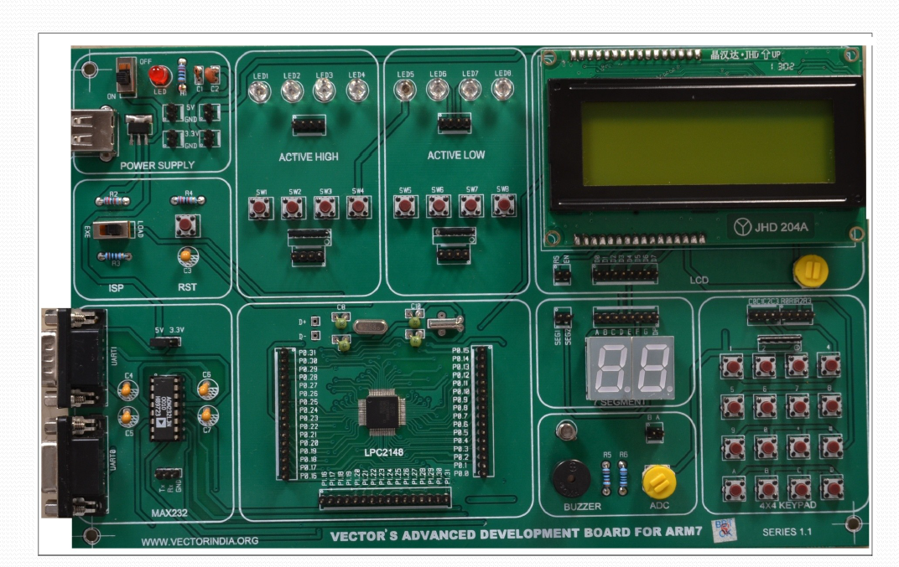
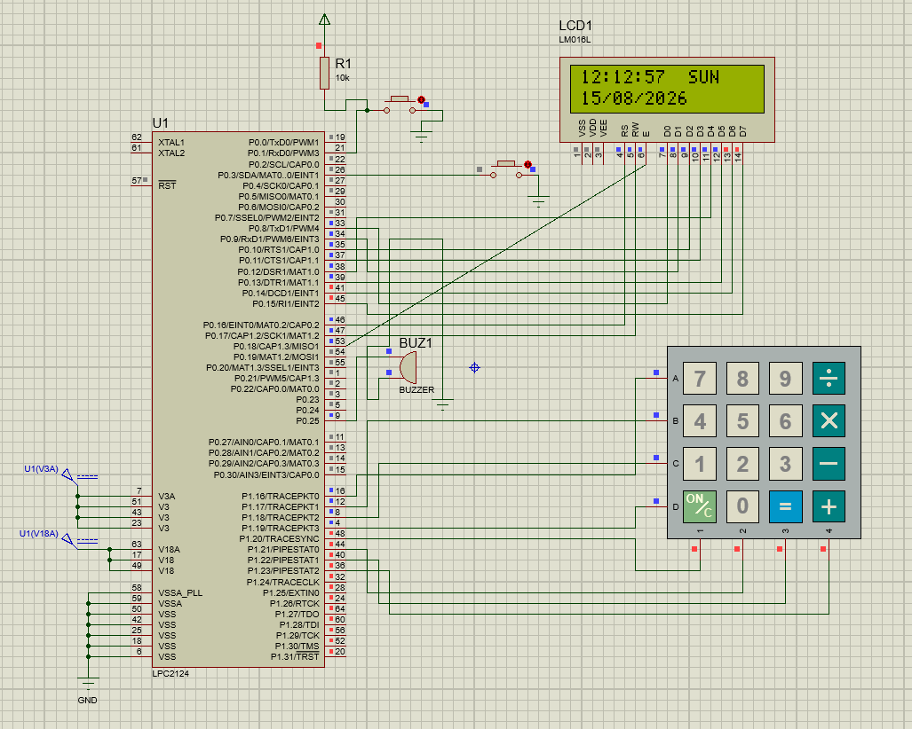

## 💊 User-Configurable Medicine Reminder System

An **Embedded C based medicine reminder system** developed using the **LPC2148 ARM7 microcontroller**. The system allows users to configure medicine timings and provides an automatic alert when it is time to take the medicine.

## 📌 About the Project

Remembering medicines at the right time can be difficult, especially when there are multiple schedules to follow.

This project provides a simple embedded solution where the user can:

* ⏰ Set and edit the RTC date and time
* 💊 Configure medicine timings
* 📟 View the current time on an LCD
* 🔔 Receive an automatic buzzer alert at the scheduled time
* ✅ Acknowledge the reminder using a switch

The system continuously monitors the configured timings and generates a reminder when the scheduled time is reached.

## 🎯 Objectives

* Display the current date and time using an RTC.
* Allow users to configure medicine timings.
* Continuously monitor the configured schedules.
* Generate an automatic alert at the scheduled time.
* Allow the user to acknowledge the reminder.
* Continue monitoring for the next scheduled medicine.

## ⚙️ How It Works

### 1️⃣ Normal Operation

The LCD continuously displays the current RTC date and time.

### 2️⃣ Configure the System

The user presses **Switch-1** to enter configuration mode.

Using the **4×4 keypad**, the user can:

* Edit the RTC date and time.
* Configure medicine timings.

### 3️⃣ Monitor Medicine Schedule

After configuration, the controller continuously compares the current RTC time with the configured medicine timings.

### 4️⃣ Medicine Reminder

When the current time matches a configured medicine time:

**LCD displays:**

> 💊 Take Medicine Now

**Buzzer:** 🔔 Generates an alert

### 5️⃣ Acknowledge Reminder

The user presses **Switch-2** after taking the medicine.

The system then:

* Stops the buzzer.
* Clears the reminder.
* Returns to normal monitoring.

If the user does not acknowledge the reminder within the configured timeout period, the buzzer automatically stops and the system continues monitoring.

## 🧩 Hardware Used

| Component             | Purpose                            |
| --------------------- | ---------------------------------- |
| **LPC2148**           | Main controller                    |
| **16×2 LCD**          | Displays time, settings and alerts |
| **4×4 Matrix Keypad** | User input and configuration       |
| **RTC**               | Maintains current date and time    |
| **Buzzer**            | Medicine reminder alert            |
| **Switch-1**          | Enters configuration mode          |
| **Switch-2**          | Acknowledges medicine reminder     |
| **USB-UART / DB-9**   | Serial communication/programming   |

## 🔧 Hardware Setup

The project was implemented using an LPC2148 ARM7 development board along with the required peripheral components.



## Proteus Simulation

The Proteus simulation circuit and connections for the project are shown below.


## 💻 Software & Technologies

* **Embedded C**
* **LPC2148 ARM7**
* **Keil IDE**
* **Flash Magic**
* **RTC Interfacing**
* **External Interrupts**
* **GPIO Programming**
* **LCD Interfacing**
* **4×4 Matrix Keypad Interfacing**

## 🔌 System Flow

```text
                    ┌──────────────────┐
                    │     LPC2148      │
                    │      ARM7        │
                    │   Microcontroller│
                    └────────┬─────────┘
                             │
              ┌──────────────┼──────────────┐
              │              │              │
              ▼              ▼              ▼
            LCD             RTC           Keypad
              │              │              │
              └──────────────┼──────────────┘
                             │
                             ▼
                    Medicine Time Match?
                             │
                            YES
                             │
                             ▼
                         ┌───────┐
                         │ Buzzer│
                         └───┬───┘
                             │
                         Switch-2
                             │
                             ▼
                    Reminder Cleared
```


## 🌟 Key Features

* ⏰ Real-time clock display
* 💊 User-configurable medicine timings
* 🔢 Keypad-based input
* 📟 LCD-based interface
* 🔔 Automatic buzzer alert
* 🔘 Interrupt-based switch control
* ✅ Reminder acknowledgment
* 🔄 Continuous schedule monitoring

## ⭐ Project Highlights

- Designed and implemented a real-time medicine reminder system using the LPC2148 ARM7 microcontroller.
- Implemented RTC-based time monitoring for scheduled medicine reminders.
- Used a 4×4 matrix keypad for user configuration and input.
- Implemented LCD interfacing for displaying time, configuration options and reminder messages.
- Used external interrupts EINT0 and EINT1 for configuration and reminder acknowledgment.
- Implemented buzzer control for automatic medicine alerts.
- Developed the project using modular Embedded C source files for different peripherals.

## 📚 Concepts Demonstrated

This project demonstrates the practical implementation of:

* ARM7 LPC2148 microcontroller
* Embedded C programming
* RTC interfacing
* LCD interfacing
* 4×4 matrix keypad interfacing
* GPIO programming
* External interrupts (**EINT0 & EINT1**)
* Timer-based control
* Buzzer interfacing
* Modular Embedded C programming

## 🚀 Future Improvements

The system can be further enhanced by adding:

* EEPROM-based permanent storage of medicine schedules
* Medicine names along with timings
* Support for multiple medicine schedules
* Mobile/wireless notifications
* Battery backup
* Improved user interface

## 👩‍💻 Project Information

**Project Type:** Mini Project
**Domain:** Embedded Systems / Microcontrollers
**Microcontroller:** LPC2148 ARM7
**Programming Language:** Embedded C
**Development Environment:** Keil IDE
**Programming Tool:** Flash Magic

## 👩‍💻 Author

**Yashaswini Mettu**

B.Tech – Electronics and Communication Engineering
